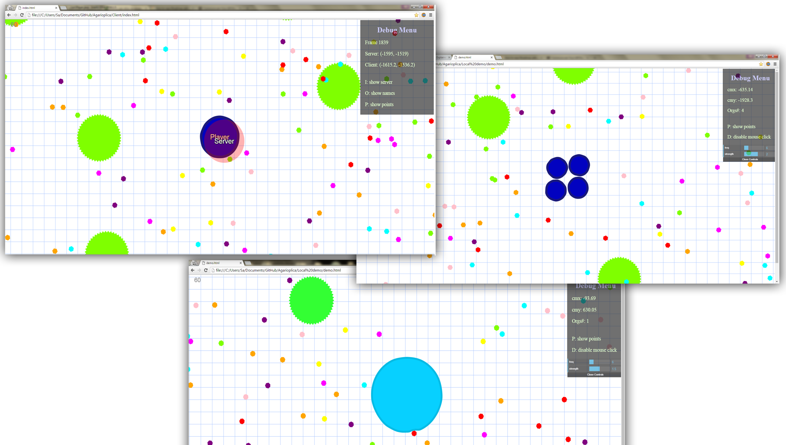

# Agar.io Clone

A replica of the real-time multiplayer browser game [agar.io](http://agar.io/), featuring client-side prediction and lag compensation based on Valve's [Source Engine](https://developer.valvesoftware.com/wiki/Source)

### STILL A WORK IN PROGRESS!


- [Agar.io Clone](#Agar.io-clone)
    + [Gameplay](#gameplay)
    + [No-server demo](#No-server-demo)
    + [Build](#build)
        * [With docker](#with-docker)
        * [With gradle](#with-gradle)
    + [Tests](#tests)
    + [Implementation](#implementation)
    + [TODO](#todo)
  
#### Gameplay
Move with mouse, shoot mass with left-click.

#### No-server demo
There is a simple browser-only demo in the [NoServerDemo](https://github.com/sam46/Agar.io-Clone/tree/master/NoServerDemo) folder. Check it out to quickly see if you dig it. 
Use Google Chrome!

#### Build
##### With docker:
To build and run the server in docker:
```
$ make start
```
this builds and runs a docker image tagged `agario` on port `8080`, and also uses the `Server` directory as a shared volume.

##### With gradle
build and run the server:
```
$ cd Server
$ gradle build run 
```

#### TODO
- [x] Fixing time-stepping on server and clients
- [ ] Handling blob generation and synchronization across clients
- [ ] Collision Detection (with Quad trees?)
- [x] Porting physics to Java on the server 
- [ ] Implementing [Source strategy](https://developer.valvesoftware.com/wiki/Source_Multiplayer_Networking) for client-server communication. Better explained [here](http://www.gabrielgambetta.com/fpm1.html) (in progress)
- [ ] Replacing string data communication between server and clients with other formats/encoding. (JSON or raw binary?) 
- [x] Enhanced graphics/effects (added blobbiness/elasticity effects)
- [ ] Tweaking input processing and buffering across threads
- [ ] Optimization for CPU-heavy code
- [ ] Creating a pre-game panel for preliminary settings and player name input
- [ ] Splitting upon colliding into viruses (in progress)
